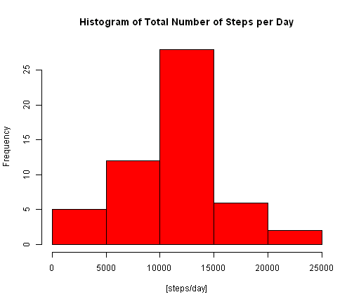
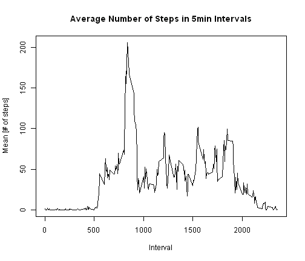
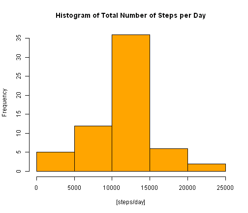
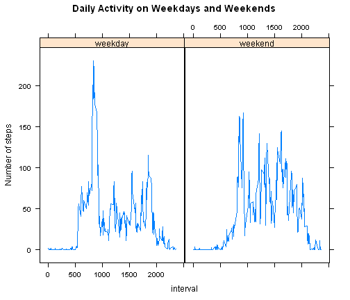

Reproducible Research: Peer Assessment 1
========================================================

**Preliminary notes to the peer reviewer :**  

1. The proceeding report is broken into sections that are indicated in bolded type (as section headers), and any output value (of mean, median, max, count, etc) or graph is preceded by an italicised note and the immediately relevant code that generated it. 

2. The downloading of the data file from the online repository is assumed, and the file "activity.csv" must be present in the same directory path as the one where the R markdown file, PA1_template.Rmd, is launched.

3. In the R codes, "echo = true" is assumed and applied as the default state, and it was not necessary to explicitly declare it in each function.

**Loading and preprocessing the data**    

The data set consists of 17568 x 3 dataframe with the following column names:    

1. "steps"
2. "date
3. "interval"  


```r
# The 'steps' column is converted to numeric data type and re-attached
data <- read.csv("activity.csv", header = TRUE)
steps <- as.numeric(data$steps)
data_01 <- data.frame(steps, data[, 2:3])
```


**What is mean total number of steps taken per day?**  

*Here is a frequency histogram of the total number of steps taken per day :*   


```r
# The total number of steps are summed up by day
by_day <- aggregate(data_01$steps, by = list(data_01$date), FUN = sum)
colnames(by_day) <- c("date", "Steps per Day")
hist(by_day[, 2], main = "Histogram of Total Number of Steps per Day", xlab = "[steps/day]", 
    col = "red")
```

 


*What is mean total number of steps taken per day?*  


```r

mean(by_day[, 2], na.rm = TRUE)
```

```
## [1] 10766
```


*What is the median total number of steps taken per day?*  


```r
median(by_day[, 2], na.rm = TRUE)
```

```
## [1] 10765
```


**What is the average daily activity pattern?**


```r
# The average number of steps is calculated across all days by 5min
# intervals
by_5 <- aggregate(data_01$steps, by = list(data_01$interval), FUN = mean, na.rm = TRUE)
colnames(by_5) <- c("interval", "mean")
```


*Here is a plot of the number of steps taken, averaged over all days in 5min intervals. The x-axis shows the i-th 5min interval over 24 hours.*  


```r
plot(by_5[, 1], by_5[, 2], type = "l", main = "Average Number of Steps in 5min Intervals", 
    xlab = "Interval", ylab = "Mean [# of steps]")
```

 


*The maximum number of steps are in the following 5min interval :*  


```r
max_index = which.max(by_5[, 2])
by_5$interval[max_index]
```

```
## [1] 835
```


**Imputing missing values**  


*The number of NA's found in the data set is the following :*  


```r
data_02 <- na.omit(data_01)
count_na <- nrow(data_01) - nrow(data_02)
count_na
```

```
## [1] 2304
```


The "NA"s are replaced with the mean value taken from 5min interval over all days, calculated with the "NA"s removed:


```r
# The 'NA's are replaced with the mean values of 5min interval over all
# days, calculated with the 'NA's removed
for (i in 1:nrow(data_01)) {
    if (is.na(steps[i] == TRUE)) {
        int_index <- data_01[i, 3]
        for (j in 1:nrow(by_5)) {
            if (by_5[j, 1] == int_index) {
                replace <- by_5[j, 2]
            }
        }
        steps[i] <- replace
    }
}
data_03 <- data.frame(steps, data[, 2:3])
```


The number of steps are tabulated per day.


```r
by_day_replace <- aggregate(data_03$steps, by = list(data_03$date), FUN = sum)
```


*Here is the new mean with the data imputed :*  


```r
mean(by_day_replace[, 2], na.rm = TRUE)
```

```
## [1] 10766
```


*Here is the new median with the data imputed :*  


```r
median(by_day_replace[, 2], na.rm = TRUE)
```

```
## [1] 10766
```


*Here is a new histogram with the imputed data :*  


```r
hist(by_day_replace[, 2], main = "Histogram of Total Number of Steps per Day", 
    xlab = "[steps/day]", col = "orange")
```

 


```r
# Format the data class from Factor to Date for the date column
date <- as.Date(data_03$date, format = "%Y-%m-%d")
```


**Are there differences in activity patterns between weekdays and weekends?**  


```r
# Create a weekdays column based on date
weekday <- vector()
for (i in 1:nrow(data_03)) {
    if (weekdays(date[i]) == "Saturday") {
        weekday[i] <- "weekend"
    } else if (weekdays(date[i]) == "Sunday") {
        weekday[i] <- "weekend"
    } else {
        weekday[i] <- "weekday"
    }
}
```


```r
# Create and label combined data set
data_04 <- data.frame(data_03$steps, date, data_03$interval, weekday)
colnames(data_04) <- c("steps", "date", "interval", "weekday")
```


```r
# Separately aggregate 5 min interval data by weekday or weekend and
# reattach weekday attributes
data_04a <- subset(data_04, data_04$weekday == "weekday")
data_04b <- subset(data_04, data_04$weekday == "weekend")
by_5_weekday <- aggregate(data_04a$steps, by = list(data_04a$interval), FUN = mean, 
    na.rm = TRUE)
by_5_weekend <- aggregate(data_04b$steps, by = list(data_04b$interval), FUN = mean, 
    na.rm = TRUE)
weekday_a <- c(rep("weekday", nrow(by_5_weekday)))
weekday_b <- c(rep("weekend", nrow(by_5_weekend)))
weekday_a1 <- data.frame(by_5_weekday, weekday_a)
weekday_b1 <- data.frame(by_5_weekend, weekday_b)
colnames(weekday_a1) <- c("interval", "mean", "weekday")
colnames(weekday_b1) <- c("interval", "mean", "weekday")
by_5_all <- rbind(weekday_a1, weekday_b1)
```


*Here is a plot of weekday and weekend data sets in 5 min intervals showing that there is substantial difference in activity patterns through out the day. It appears that people are more active through the day on weekend days, but during weekdays, there is a burst of activity in the morning, but less activity throughout the day.*  


```r
# Load lattice plot and plot by weekday
library(lattice)
xyplot(mean ~ interval | weekday, by_5_all, type = "l", ylab = "Number of steps", 
    main = "Daily Activity on Weekdays and Weekends")
```

 

